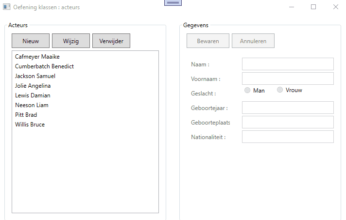

# Oefening Acteurs : klassen en velden

Bekijk onderstaand filmpje aandachtig zodat je weet wat er van je verwacht wordt.  
  
Je voegt een class libraray toe aan je solution en je maakt daar 1 klasse in : Actor.  
De klasse Actor zal gegevens bijhouden van 1 acteur/actrisse.  Deze gegevens worden bijgehouden in velden :   
  * lastname : string (verplicht in te voeren)  
  * firstname : string (verplicht in te voeren) 
  * gender (*)   (verplicht in te voeren) 
  * yearOfBirth : int (verplicht in te voeren)  
  * placeOfBirth : string (niet verplicht)
  * nationality : string (niet verplicht)  

(*) gender : je voorziet in je klasse ook een enumeratie Gender met mogelijke waarden Male en Female.  Het veld gender gebruikt dit enumeratietype.  

De klasse Actor heeft 1 constructor die alle waarden als argumenten ontvangt (dus 6 parameters).

De klasse Actor overschijft de ToString() methode en toont in de plaats "lastname - firstname".

In je WPF venster zijn alle controls en alle event handlers reeds aanwezig.  
Let er op dat je venster als het ware opgesplitst is in 2 delen : links zit alles in een groupbox met de naam grpActors, rechts zit alles in een groupbox met de naam grpData.  
Bij opstart is grpActors toegankelijk en is grpData ontoegankelijk (denk aan eigenschap isEnabled).  
Wanneer een nieuwe acteur toegevoegd worden of een bestaande acteur gewijzigd wordt, dan is grpActors ontoegankelijk en grpData wel toegankelijk.  

Je houdt in je WPF venster een List van actors bij (maak hier dus een globale variabele van).  
Tijdens het opstarten vul je deze List met een aantal zelf te verzinnen acteurs (= seeding) zodat je meteen met je programma aan de slag kunt.  
Uiteraard dient de listbox lstActors steeds een afspiegeling te zijn van deze List.

Denk ook even na over het volgende : wanneer je straks op bewaren gaat klikken (btnSave) dan dien je op dat moment nog te weten of je een nieuwe acteur moet toevoegen aan de List of een bestaande acteur (deze die geselecteerd staat in lstActors) dient aan te passen ...   

Voorzie ook controle op invoer in je WPF (zie de verplichte velden) : m.a.w. je mag bv geen acteur toevoegen zolang zijn naam niet ingevoerd werd.

  
  
